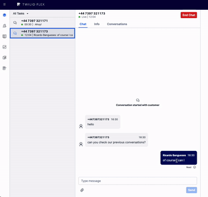
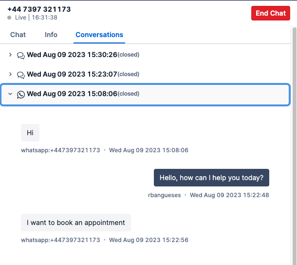

# Conversation History Plugin

This plugin adds a new tab on the task canvas (Conversations), which presents a list of previous conversations that this user had with the Flex agents. It uses twilio paste for styling.

The agent is able to see a list of conversations, ordered by date (most recent -> most old), with an icon identifying the channel (whatsapp / chat / sms), as well as the state of the conversation (active / closed). The plugin will fetch conversations older than N months and present up to M conversations at the same time. 

## How does this work?

This plugin leverages the Conversations API to fetch those conversations where the "from" address is a participant. Whether we receive a whatsapp, chat or sms, we do a fetch for conversations based on:
- whatsapp:{phonenumber}
- {phonenumber}

Chat interactions cannot be easily fetched by default as the search by participant uses 'identity' to fetch. Every time there's a new chat, the task will have a different UUID as identity. To resolve this, this plugin assumes you will use a pre-engagement form where the {phonenumber} will be captured and set. 

Assuming you capture the phone number as the friendly name on your pre-engagement form, this information can then be passed on to the plugin via Studio, on the 'Send to Flex' widget, as such:

{"from":"{{trigger.conversation.ChannelAttributes.pre_engagement_data.friendlyName}}"}

The plugin modifies the 'WrapupTask' flex action when there is a new chat conversation. It will update the conversation right before closing it, adding the "from" address as a 'messaging_binding' so this conversation can be tied to the {phonenumber} participant.

## Configuration

1. Deploy the serverless functions within the serverless folder. Here's a brief description of the functions:
- addParticipantToConversation: this function is used by the plugin to add a new messaging_binding to the chat conversations before closing so they can be fetched.
- fetchAllConversationsByParticipant: this function will fetch all the conversations (whatsapp/sms/chats), put them in a list, sort them in alphabetical order and return them. It uses a start date as a way to filter the searches, i.e. it can fetch all conversations from the past month or past N months.
- fetchConversationByParticipant: as above, but will keep the whatsapp and the chat/sms conversations separate.
- fetchConversationMessages: this function will fetch the conversation messages as well as other details within a conversation. 

The functions have the following configuration parameters:

fetchAllConversationsByParticipant / fetchConversationByParticipant:
- const MAX_CONVERSATIONS_TO_FETCH = 100;
- const MAX_CONVERSATIONS_TO_PRESENT = 20;
- const MAX_PERIOD = 12;

fetchConversationMessages:
- const MAX_MESSAGES_TO_FETCH = 100;

2. Configure the plugin with the desired environment variables

REACT_APP_SERVERLESS_DOMAIN_URL=https://xxxxxxxx.twil.io/ #domain hosting your serverless functions
FETCH_CONVERSATIONS_AS_OLD_AS=1 # in months

3. Test the plugin and tailor to your needs.

